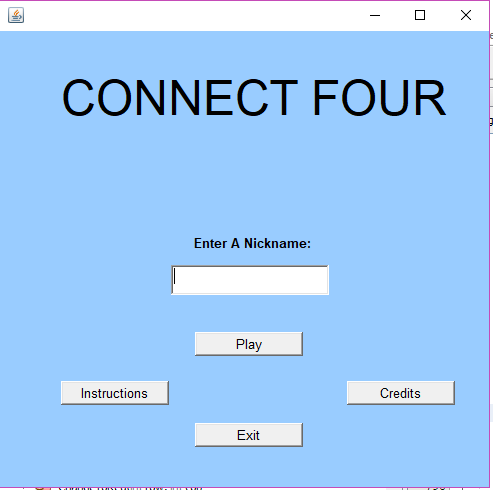
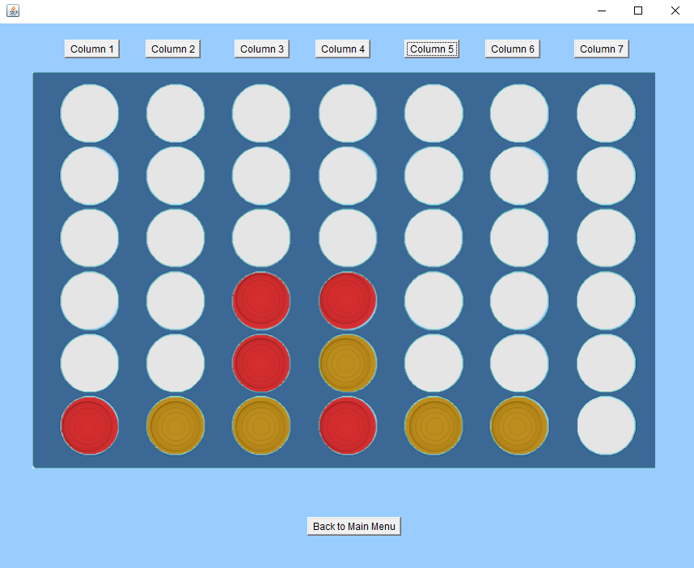
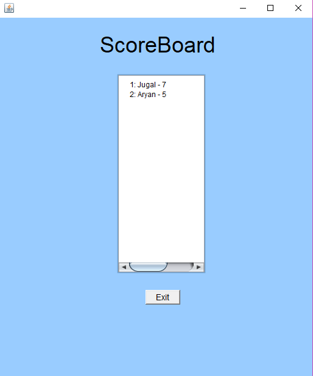

# Java - Connect Four

## Sections 
- [Description](#description)
    - [How to Play](#how-to-play)
    - [Objective](#objective)
- [Getting Started](#getting-started)
    - [Dependencies](#dependencies)
    - [Installing](#installing)
    - [Executing](#executing)
    - [Troubleshooting](#troubleshooting)
- [Author](#author)
- [License](#license)

---
## Description
Connect Four consists of a 7x6 game board and a button for each column where you can press the respective button for a column to drop your coin in. The blank space will then change to a yellow coin (users coin) and then a red coin will also be placed randomly by the computer. 





<br />

### How to Play
Enter a nickname before pressing play. This is required for you to be on the scoreboard. When in the game, press the buttons at the top of the game board to select which column you would like to place your coin in.

<br />

### Objective
The first part is to beat the computer by getting four checkers in a row, in a column or diagonally. The second part is be achieving the least amount of turns to get four checkers in a row.

---
## Getting Started
<br />

### Dependencies
- Java SE 8 (Minimum Version)
- Mac/Windows OS

<br />

### Installing 
```bash
$ git clone https://github.com/JugalBili/Java-ConnectFour
```
Or you can download the zip directly from github. 

<br />

### Executing
To execute to program, open the zip file into an IDE of your choice, or use: 
```bash
java ConnectFour.java
```
> **Make Sure** to run the command inside the src folder 

<br />

### Troubleshooting
If you encounter an error of missing
```java
org.netbeans.lib.awtextra.AbsoluteConstraints
```

or
```java
org.netbeans.lib.awtextra.AbsoluteLayout
```
Add the following jar to the project libraries
```bash
libraries\AbsoluteLayout.jar
```

---
## Author 
**Jugal Bilimoria and Aryan Arora**
<br />August 1st 2019

<br />This project was made as a grade 12 online Computer Science class final project.

---
## License 


MIT License

Copyright (c) 2020 Jugal Bilimoria

Permission is hereby granted, free of charge, to any person obtaining a copy
of this software and associated documentation files (the "Software"), to deal
in the Software without restriction, including without limitation the rights
to use, copy, modify, merge, publish, distribute, sublicense, and/or sell
copies of the Software, and to permit persons to whom the Software is
furnished to do so, subject to the following conditions:

The above copyright notice and this permission notice shall be included in all
copies or substantial portions of the Software.

THE SOFTWARE IS PROVIDED "AS IS", WITHOUT WARRANTY OF ANY KIND, EXPRESS OR
IMPLIED, INCLUDING BUT NOT LIMITED TO THE WARRANTIES OF MERCHANTABILITY,
FITNESS FOR A PARTICULAR PURPOSE AND NONINFRINGEMENT. IN NO EVENT SHALL THE
AUTHORS OR COPYRIGHT HOLDERS BE LIABLE FOR ANY CLAIM, DAMAGES OR OTHER
LIABILITY, WHETHER IN AN ACTION OF CONTRACT, TORT OR OTHERWISE, ARISING FROM,
OUT OF OR IN CONNECTION WITH THE SOFTWARE OR THE USE OR OTHER DEALINGS IN THE
SOFTWARE.